# Kerfspan finished-panel gallery

Clean, full-resolution panel renders generated by the current Kerfspan application from a consented portrait. The source photograph is not included or shown. Material previews use charcoal for retained metal and white for openings; Back-lit previews show those openings illuminated.

These images demonstrate visual treatments rather than certifying cut readiness. A real project must still be validated against its manufacturing profile before CAM export.

| | | |
|---|---|---|
|  | 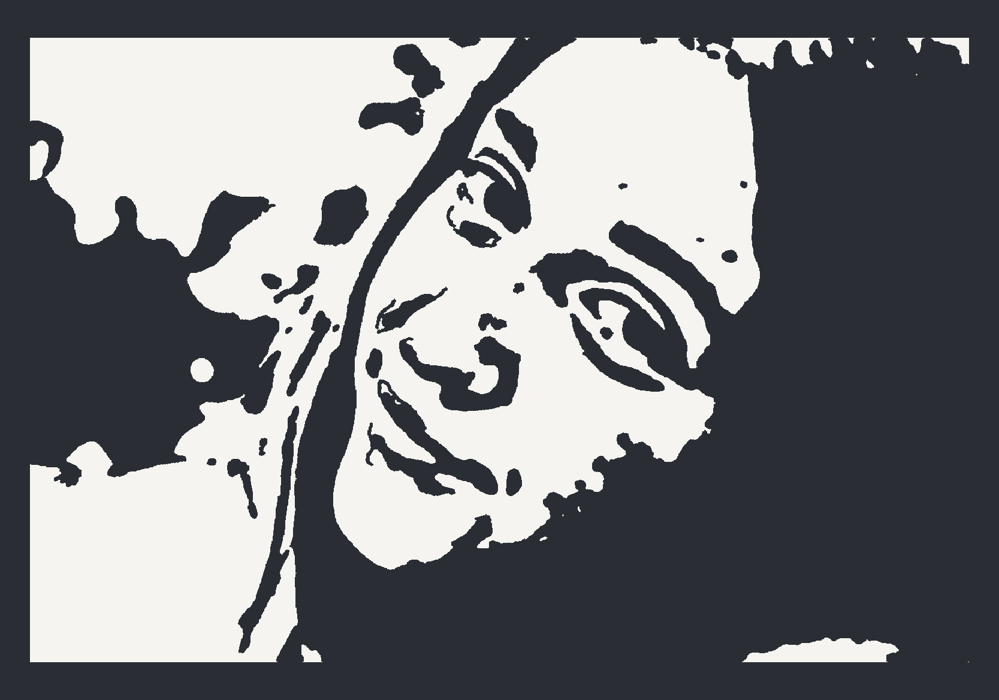 | 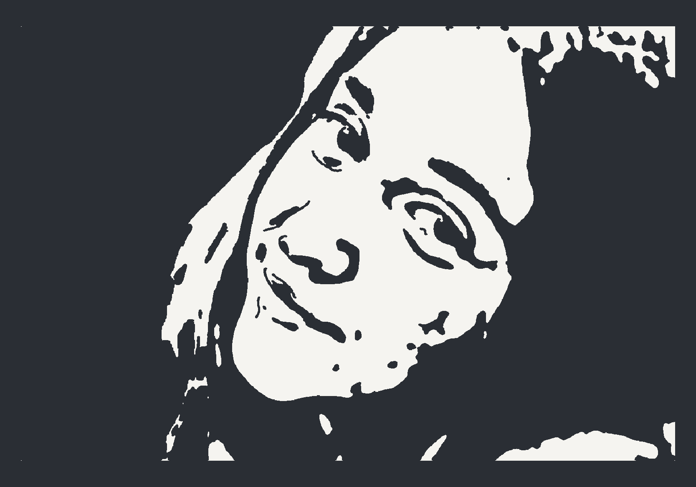 |
| Line art | Poster stencil | Icon stencil |
| 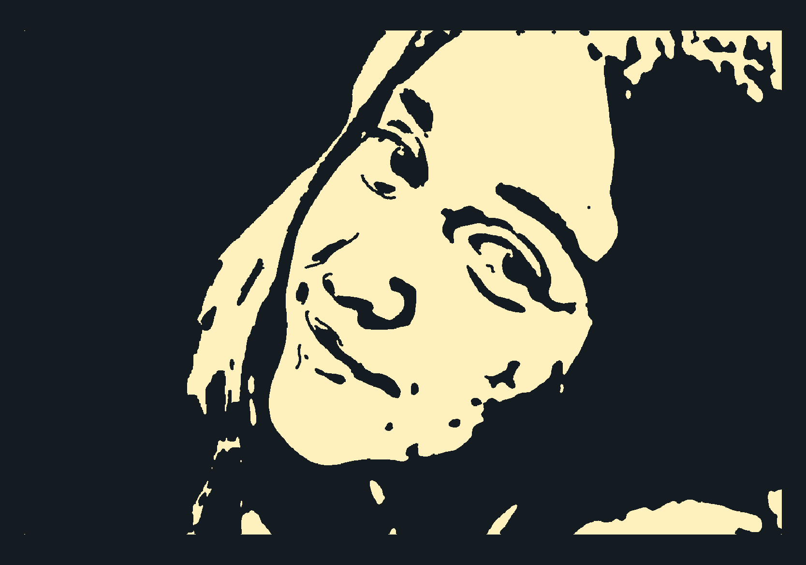 |  |  |
| Icon stencil · Back-lit | Graphic portrait | Silhouette |
| 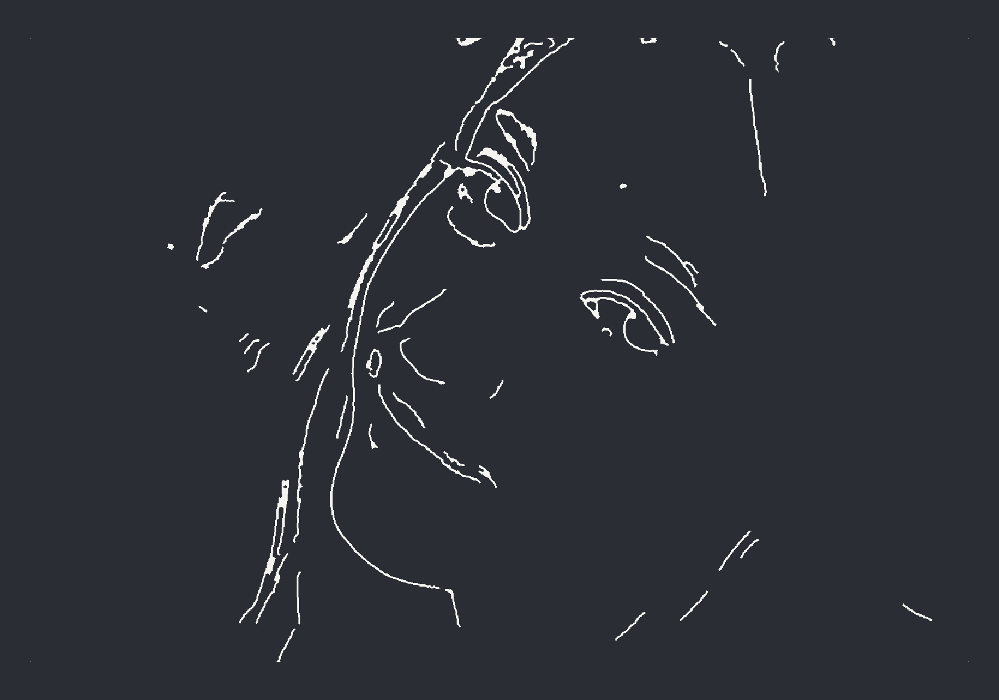 | 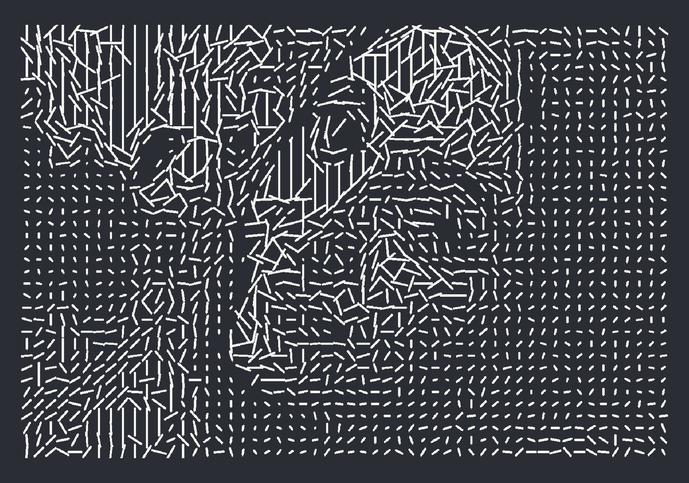 | 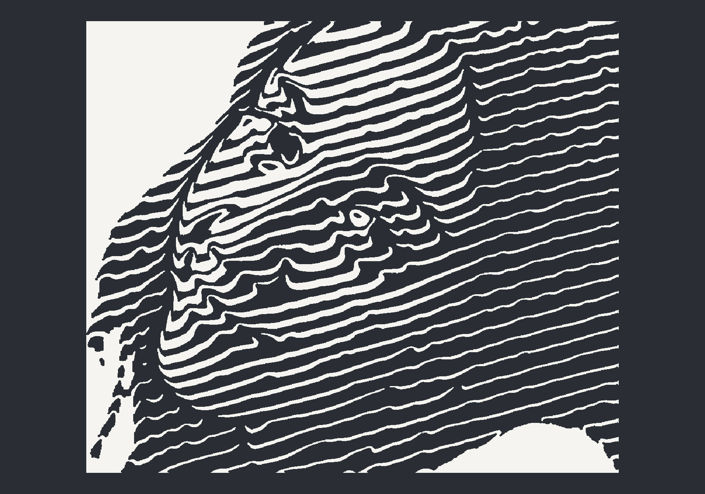 |
| Negative-space linework | Icon / Woodcut | Flow engraving |
| 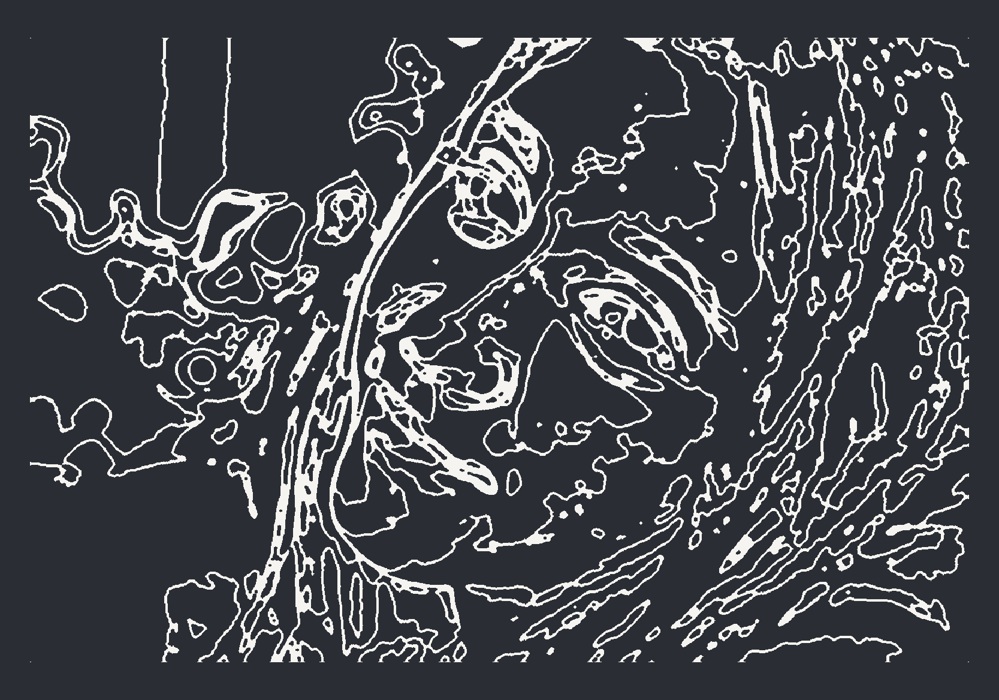 | 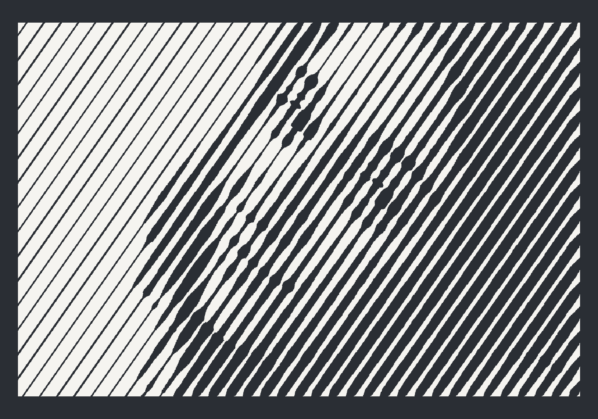 | 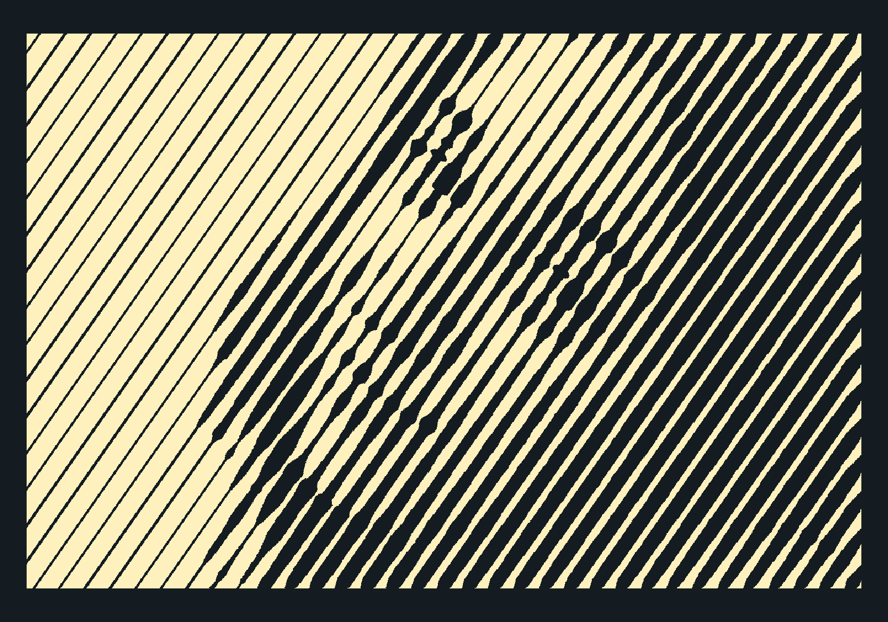 |
| Contour bands | Slats | Slats · Back-lit |
| 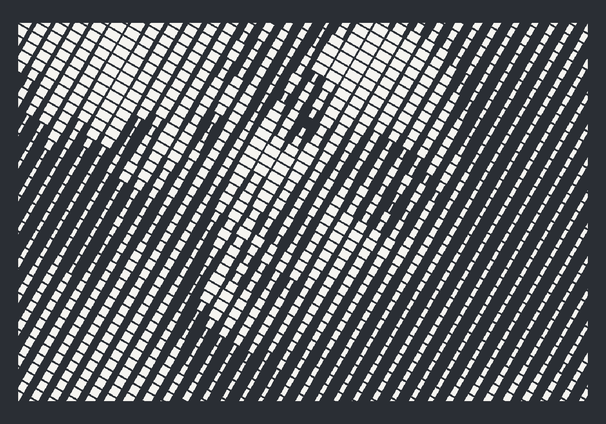 | 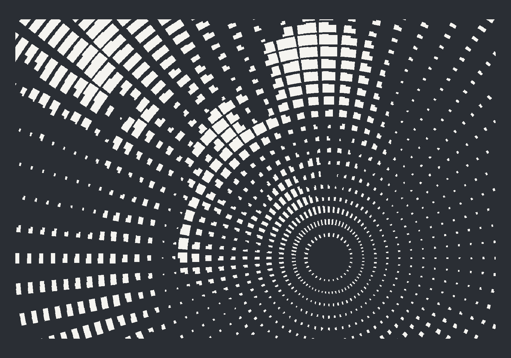 |  |
| Hatch | Radial cuts | Variable dots |
| 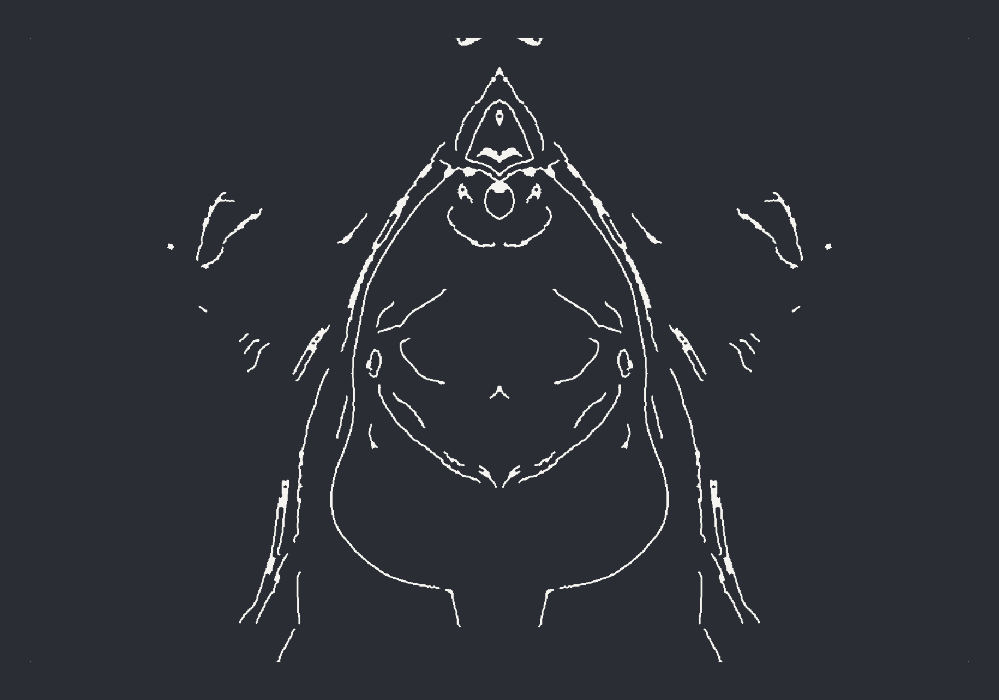 | | |
| Ornamental symmetry | | |
